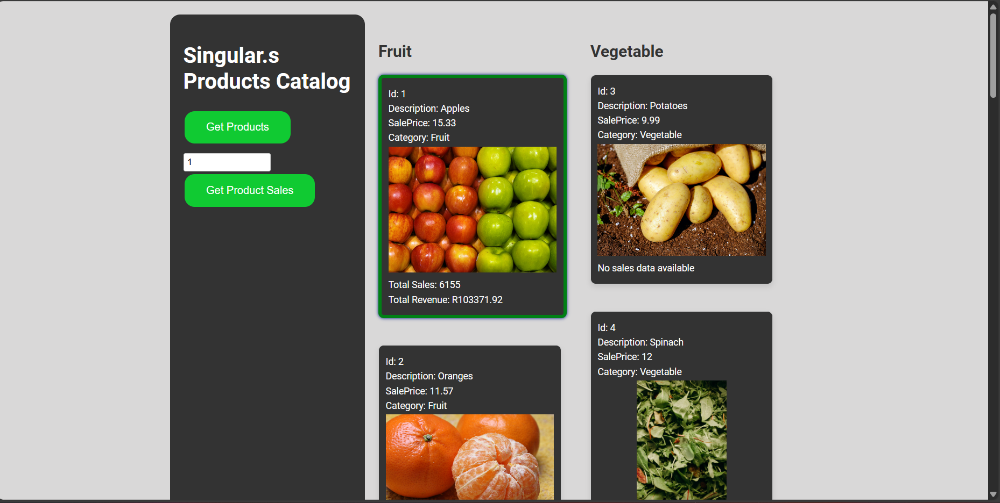

Singular.s Products App

Welcome to the Singular.s Products App! This application allows you to browse products and view their sales data.

Getting Started
Follow these steps to run the app locally on your machine:

Prerequisites
Node.js installed on your machine. You can download it here.
Installation
Clone the repository to your local machine:

git clone https://github.com/ayahlangagthb/al-singular-products-app.git

Navigate to the project directory:

cd al-singular-products-app
Install dependencies:

npm install
Running the App
Start the development server:

npm start

Open your web browser and navigate to http://localhost:3000 to view the app.

Using the App:

Click the "Get Products" button to load the available products.
Enter a product ID and click "Get Product Sales" to view sales data for that product :)

Tech Stack:
React.js
Node.js
C# .NET 8
CSS

Danki, Syabonga!!
Broaght to you by A Langa.